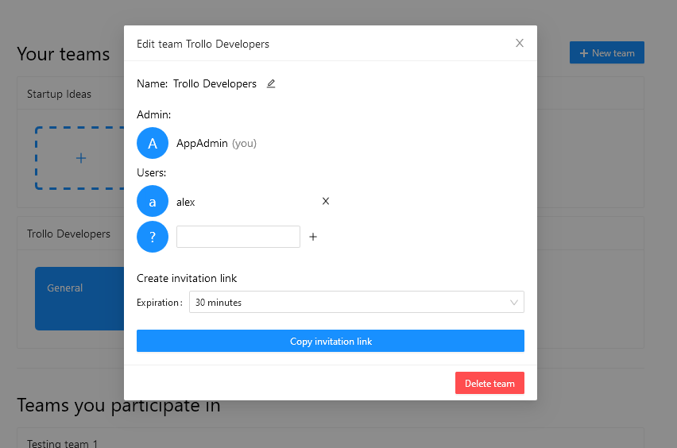
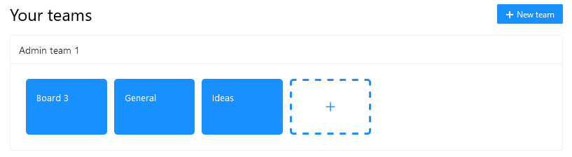
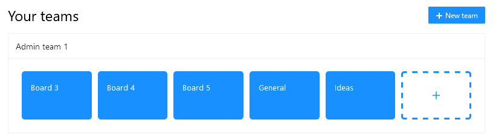
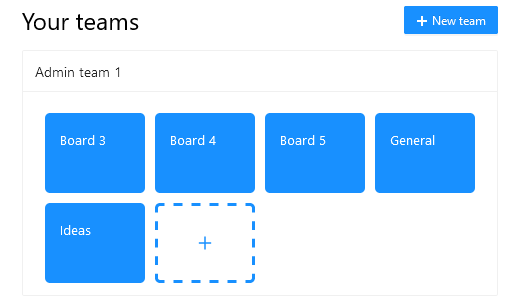
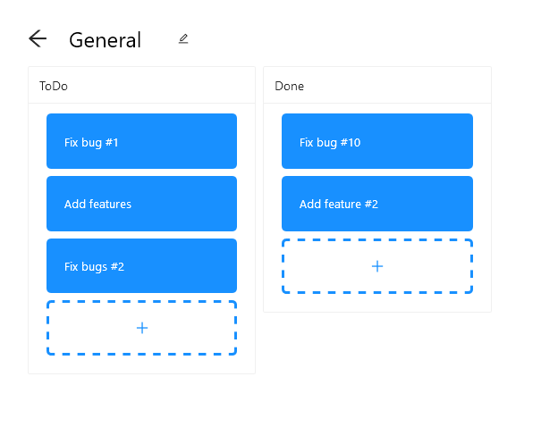
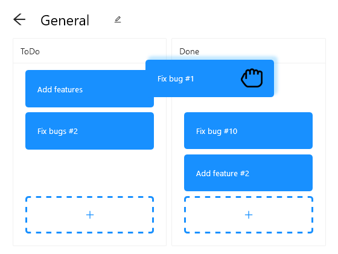
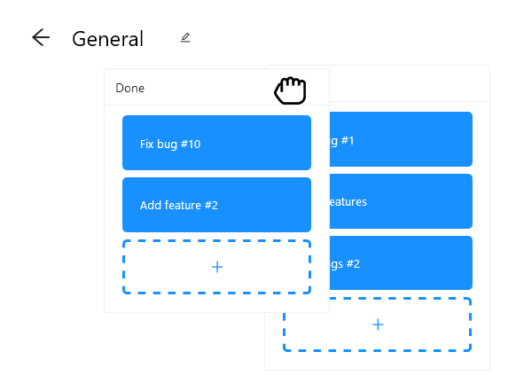

<h1 style="font-family: Pacifico; color: #1890FF;">Trollo</h1>

#### David Hrabě, 4. F 

#### 2021

---

## Nápad
|||
## Trello
|||
Organizační nástroj pro týmy
|||
Zdarma
|||
Spousta integrací s jinými aplikacemi
Note: Například Slack a MS Teams

---

## Technologie
|||

<h3 style="color: #007ACC">TypeScript</h3>
|||

<h3 style="color: #539E43">Node.js</h3>
Note: Umožňuje spouštět aplikační servery napsané v JavaScriptu. JavaScript normálně běží pouze v prohlížeči. Sice je pomalejší než jiné systémy, ale umožňuje používat stejný jazyk na frontendu a na backendu, což je pro programátory pohodlnější.
|||

<h3 style="color: #61DAFB">React</h3>
|||

<h3 style="color: #000000">Next.js</h3>
Note: Frontend framework, založený na Reactu. Je předkonfigurovaný pro server-side rendering.
|||

<h3 style="color: #E535AB">GraphQL</h3>
|||

<h3 style="color: #000000">Apollo</h3>
Note: GraphQL knihovna pro backend (server) a frontend (client). Server umožňuje sestavit GraphQL schéma a zpřístupnit ho na GraphQL endpointu. Client umí volat z frontendu dotazy a operace na backendu. Má normalizovanou cache, což znamená, že data automaticky strukturuje a organizuje v globální cache paměti.
|||

<h3 style="color: #336791">PostgreSQL</h3>
Note: Jeden z nejpoužívanějších SQL databázových systémů. Oproti třeba MySQL má mnoho funkcí navíc, podpora pro více typů, např. boolean, byte array (soubory) a dokonce JSON dokumenty. 

---

<h2 style="color: #007ACC">TypeScript</h3>
|||

|||
Striktně typovaný
|||
Úroveň kontroly typů je konfigurovatelná pomocí souboru tsconfig

---

<h2 style="color: #61DAFB">React</h3>
|||
JSX
|||
Komponenty
|||
<pre><code data-trim>
const Logo = () => <h1>Trollo</h1>
</code></pre>
|||
Props
|||
<pre><code data-trim data-line-numbers="1|3"></code></pre>

---

## REST
|||
Způsob komunikace BE a FE
|||
Je definován tzv. endpointy
|||
Jeden endpoint je vlastně URL adresa
|||
Typy operací se rozlišují pomocí HTTP metod

---

## GraphQL
|||
Alternativa RESTu
|||
Vše je na jednom endpointu
|||
Queries
|||
Mutations
|||
Subscriptions

---

/board/:id
|||
Nevíme, co nám z BE přijde

---

<pre><code data-trim data-noescape class="graphql">
board(id: $boardId) {
  id
  name
  lists {
    id
    name
    index
    cards {
      id
      name
      description
    }
  }
}
</code></pre>
|||
Dostaneme z BE přesně to, o co si řekneme

---

# Styly

---

## Ant Design

---

## CSS
|||

|||

|||

---

## React Beautiful DnD

|||

|||

---

### Prezentace:
- Markdown
- reveal.js

---

## Děkuji za pozornost
